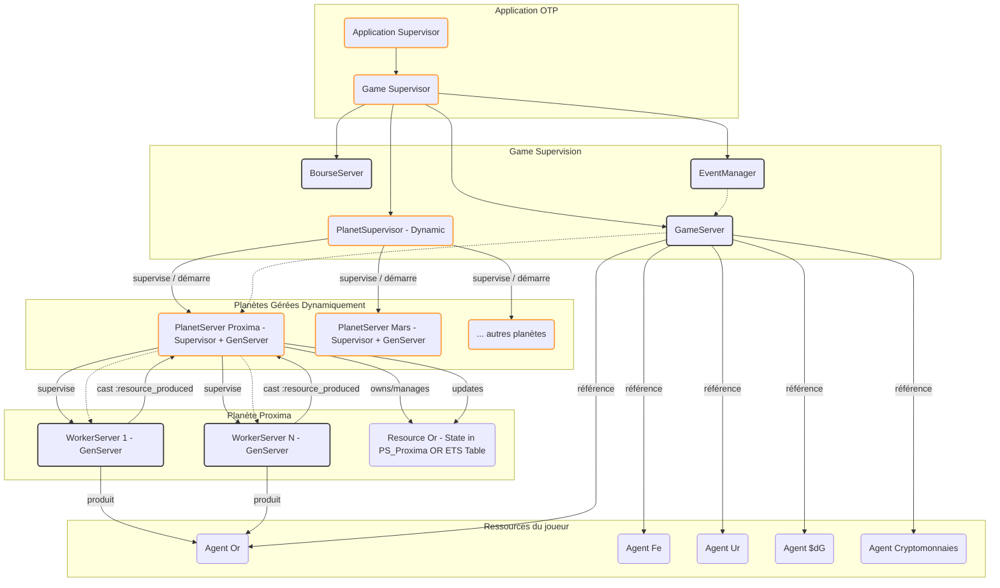

# "Cahier des charges"

## Mécanique du jeu
Plusieurs planètes (10). Sur chaque planète, possibilité d'acheter des robots pour récolter des ressources. Possibles d'acheter de nouvelles planètes si assez de ressource et de l'argent ($dG). Vendre ressource dans la bourse. Possibilité d'acheter bonus. Événements aléatoires.

La monnaie du jeu est le doublon galactique ($dG), pour information, 1 $dG équivaut à 100'000 CHF (Cours de l'année 2467)

Le joueur commence avec 10'000 doublon galactique, 500 fers et 10 travailleurs (robotiques) sur sa planète de départ.

La bourse galactique est une entité auquel des cryptomonnaies y sont inscrite en plus des ressources. Le joueur peut alors acheter des cryptomonnaies et espérer que ses investissements s'envolent "To Proxima Centori !" (To the moon étant un peu bof en 2467). La bourse galactique, tout comme celle de Tokyo ou de Manhattan est complètement aléatoire. Les ressources tangibles sont néanmoins plus stables que les cryptomonnaies.

## But du jeu 

Le but ultime est de prospérer le plus longtemps possible en évitant la faillite. Dès que l’argent
rentre dans le négatif, c’est la fin !

### Evenements aléatoires

#### Lié à la bourse 
- Augmentation des taxes d'import, l'homme le plus influant du commité intergalactique a décidé d'augmenter les taxes d'import dans la voie lactée, la bourse s'écroule...
- Une nouvelle technologie révolutionnaire est découverte, propulsant les actions des entreprises technologiques.
- Un scandale de corruption secoue le Conseil Galactique, faisant chuter les valeurs boursières de 15%.
- Une alliance commerciale entre systèmes indépendants renforce certains secteurs économiques.

#### Lié aux ressources du joueur
- Une guerre éclate sur X planète du joueur, il perd les 3/4 de ses robots travailleurs.
- Une pluie de météorites riches en minerais s'abat sur une des planètes du joueur, augmentant la production de 20% pendant 5 minutes.
- Un virus informatique paralyse les robots miniers du joueur pendant 2 minutes, encore un coup de ces Jupitériens jaloux de vos planètes téluriques, leur efficacité est réduite de moitié.
- Des pirates spatiaux volent 25% des ressources du joueur stockées sur la planète X.

#### Lié à l'argent du joueur
- Un proche du joueur a été kidnappé, les malfrats ayant fait leur recherche, ils demandent 1/3 de l'argent du joueur.
- Le Trésor Galactique accorde un stimulus économique, vous recevez 2'000 $dG.
- Une erreur administrative vous oblige à payer des arriérés d'impôts équivalents à 15% de votre fortune.
- Vous remportez un tournoi de Holo-Échecs, empochant 5'000 $dG.
- Une de vos expéditions découvre un artefact ancien qui se vend 8'000 $dG au musée central.

### Couts récurrents

Pour que le joueur puisse perdre, il faut qu'il ait des coûts récurrents. Ces coûts sont à payer chaque x temps, dépendamment de la ressource. 

- **Maintenance des Robots** : Chaque robot coûte une petite somme de $dG par minute pour sa maintenance. Plus vous avez de robots, plus vos coûts fixes augmentent.

- **Taxes Planétaires** : Chaque planète possédée au-delà de la première est sujette à une taxe intergalactique annuelle, chaque 5 minutes. Posséder beaucoup de planètes devient un fardeau financier s'il n'est pas compensé par une production suffisante.

### Bonus achetables
- Récolte du fer x1,25
- Récolte de l'or x1,25
- Récolte de l'uranium x1,25
- Récolte du plutonium x1,25
- Récolte de l'hasheidium x1,25

### Entités du jeu
#### Planètes + ressource associée
- Mars               - Fer (Fe)
- Proxima Centauri Z - Or (Or)
- Struve 2398        - uranium (Ur)
- Barnard E          - Fer (Fe)
- TOI-5432           - plutonium (Pu)
- GUI-ED 2025        - Or (Or)
- Yver-Dion          - hasheidium (Hu)
- 99-Triva           - uranium (Ur)
- Ze-BI              - plutonium (Pu)
- Ches-Om            - Hasheidium (Hu)

### Technique

